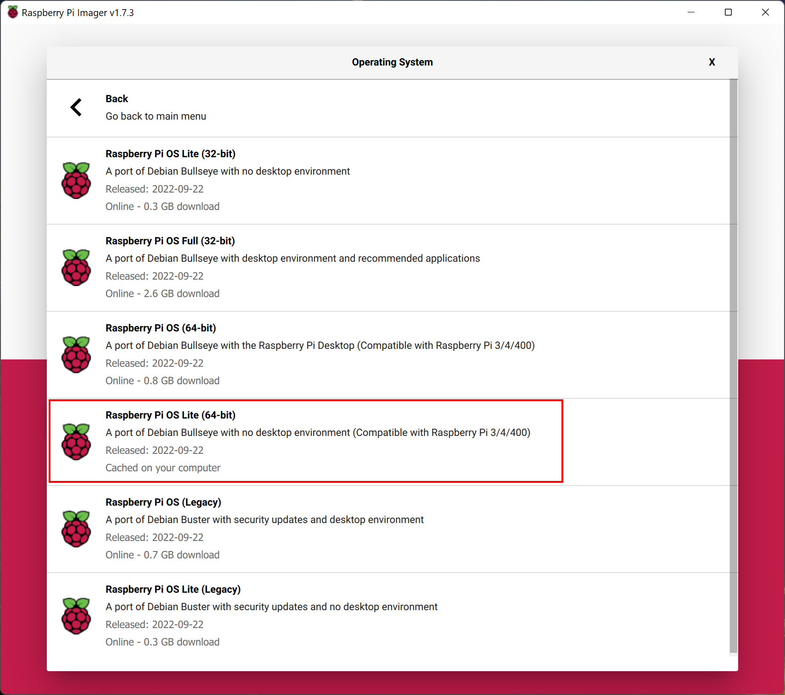

# How to setup your Raspberry Pi


- [How to setup your Raspberry Pi](#how-to-setup-your-raspberry-pi)
  - [What you need to Start](#what-you-need-to-start)
  - [Installation of the Operating System](#installation-of-the-operating-system)
  - [Start up Raspberry Pi](#start-up-raspberry-pi)
  - [Connect to the Raspberry Pi](#connect-to-the-raspberry-pi)

## What you need to Start

You should prepare the follwoing items, before you continue:
> - Raspberry Pi 4B (at least 4 GB of RAM are recommended)
>   - Power Supply
>   - Micro SD Card
> - Computer with SD card reader
> - Ethernet Cable

## Installation of the Operating System

To flash the Operating System to the SD Card we are using the [Raspberry Pi Imager](https://www.raspberrypi.com/software/).

1. Download and install the Rapberry Pi Imager on your Computer
2. Start the Imager
3. Click on "Chose OS"

    

4. Select "Raspberry Pi (Other)"

    

5. Select "Raspberry Pi OS Lite (64-bit)" **Be sure, that you chose the 64-bit Version** 

    

6. Click on "Chose Storage"
   
   
   
7. Select your SD Card. **Be sure, that you select the correct card, then all Data of ths Card will get erased during this Process**

    

8. Click on the Gearbox on the bottom right, to change some additional Settings

    

9. Change the following Settings:
   - Hostname: Set your Prefered Hostname
   - Username: Select an username for your Raspberry Pi (we reccomend using "pi")
   - Password: Select an password for your Raspberry Pi
   - SSID and Password: Enter the SSID and Password of your Wifi Network (Optional)
   - Country, Time Zone and Keyboard: Change this to your prefered Settings
   
    

10. Click on "Write"
    
    

11. Confirm, that you have selected the Correct SD Card and that all Data on this SD Card will be erased.

    
    
12. When the flashing is finished, rmove the SD Card from your Computer
    
---

## Start up Raspberry Pi

1. Insert the SD Card in to your Raspberry Pi
2. Connect the Raspberry Pi with the Ethernet Cable to your Router or Switch
3. Plug in the Power Supply
4. Wait until the first Boot has completed. This can take up to 5 minutes


## Connect to the Raspberry Pi

After the Pi has booted up, we can connect to our Raspberry Pi

1. Open a Command Promt, by typing CMD in to your Windows Search
2. Enter the following Command:
   - change the "pi" to your Username, if you changed it during Installtion
   - replace "home-server" with the hostname you set during installation
  
```
ssh pi@home-server.local
```

3. On the first connection you will get an warning, that you connecting to an unknown Device. To confirm that, enter "yes" and confirm by pressing Enter
4. Enter your Password and confirm by pressing Enter. **Note: you will not see any input, when you enter your Password**
5. If the Connection was succsessfuly you should see the following line in your Command Promt:

```
pi@home-server:~ $
```