# How to install the Containers

- [How to install the Containers](#how-to-install-the-containers)
  - [Check prerequisites](#check-prerequisites)
  - [Connect to Raspberry Pi](#connect-to-raspberry-pi)
  - [Start the Script](#start-the-script)

## Check prerequisites

Please check all prerequisites from [Readme.md](../README.md)


## Connect to Raspberry Pi
1. To begin, Log-in to your Raspberry Pi via ssh. 
      - If you use Windows, open PowerShell
      - If you use Linux or macOS open Terminal
2. Enter the following command:
   - change the "pi" to your Username, if you changed it during installation
   - replace "home-server" with the hostname you set during installation
  
```
ssh pi@home-server.local
```

3. On the first connection, you will get a warning, that you're connecting to an unknown Device. To confirm that, enter "yes" and confirm by pressing Enter
4. Enter your Password and confirm by pressing Enter. **Note: you will not see any input, when you enter your Password**
5. If the Connection was successfully, you should see the following line in your command prompt:

```
pi@home-server:~ $
```


6. If you connected Successfully to the Raspberry Pi, elevate yourself to superuser using the following command:
```
sudo su
```

## Start the Script
1. Copy the following Code into your Bash Command Line
```
cd /tmp; rm install.sh &> /dev/null; wget https://raw.githubusercontent.com/b-tomasz/Simplify-Home-Automation/main/install.sh &> /dev/null; bash install.sh
```

2. After the script started, select Install and press Enter

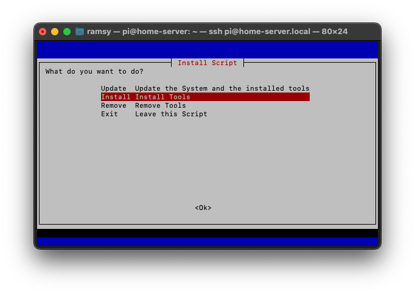
  
3. The System will now check a few parameters. Like the following:
    - your systems architecture
    - if your System is up-to-date
  
<br>

4. If one or multiple fail, you will get notified like this:

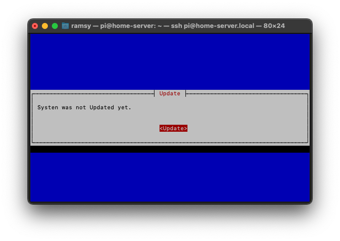

5. In the next prompt, you will be asked to update the System.
Select "Update" to start the process

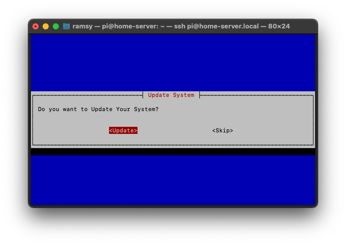

6. As soon the update is finished, the script continues with some essential prompts.

    - Please enter Fixed IP and IP of your Router.

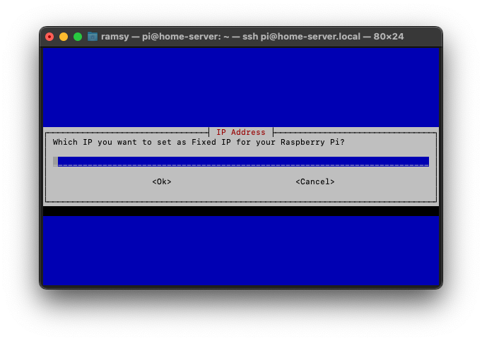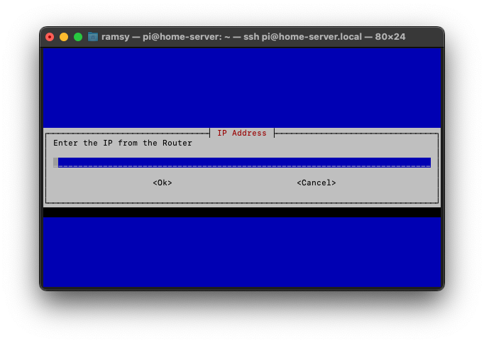

7. The next prompt is about the External Domain, this will be used to connect to your system via this domain. If you select Yes, your port forwarding must be active to the Raspberry Pi as described in the script. Your External Domain must resolve to your Public IP. For example, you can use Bitwarden from everywhere. If you select no, Bitwarden, VPN and SSL can't be installed.

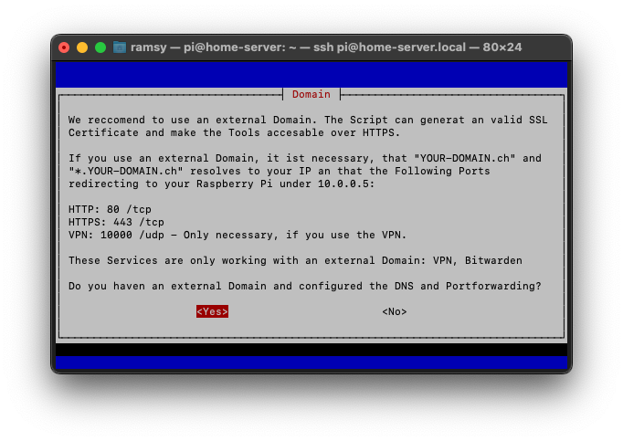

8. If you choose yes, you will get asked to type in your External Domain and your E-Mail address. Otherwise, this part will get skipped.

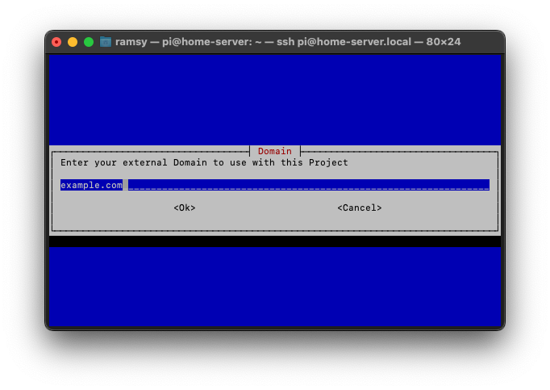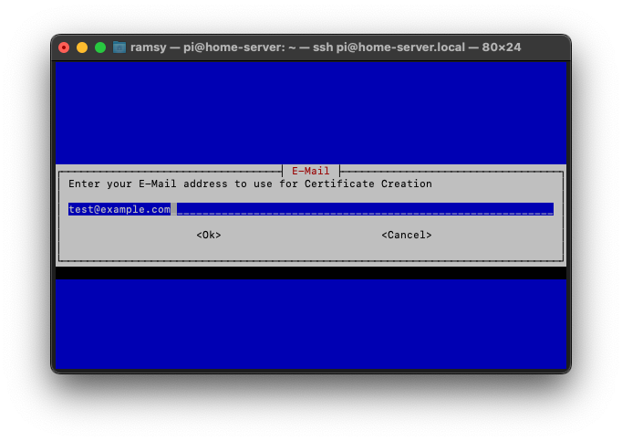

9. Now the Raspberry Pi needs to reboot, to apply the configured Settings. Reconnect to the Pi as described earlier.

10. After you successfully reconnected to the pi, you need to restart the script using the following command:
```
cd /tmp; rm install.sh &> /dev/null; wget https://raw.githubusercontent.com/b-tomasz/Simplify-Home-Automation/main/install.sh &> /dev/null; bash install.sh
```

11. Choose install. Now the Docker installation begins. This is the prerequisite for all the following steps.

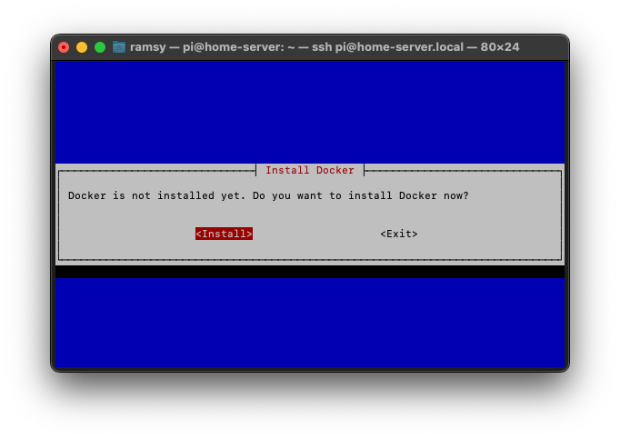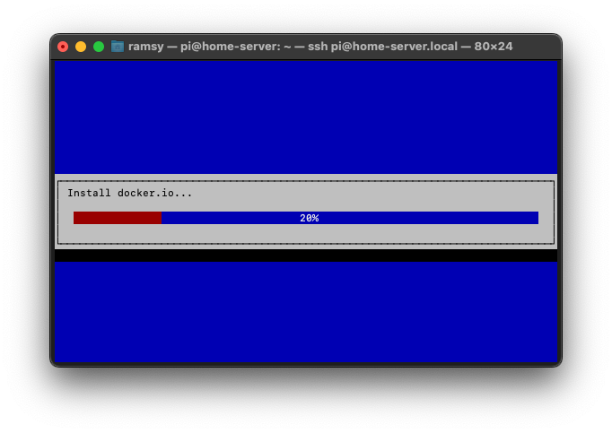

12. As soon as Docker is installed, the next prompt will ask what Applications to install. You can navigate with the arrows and select with the space bar on the keyboard. Confirm your selection with Enter.

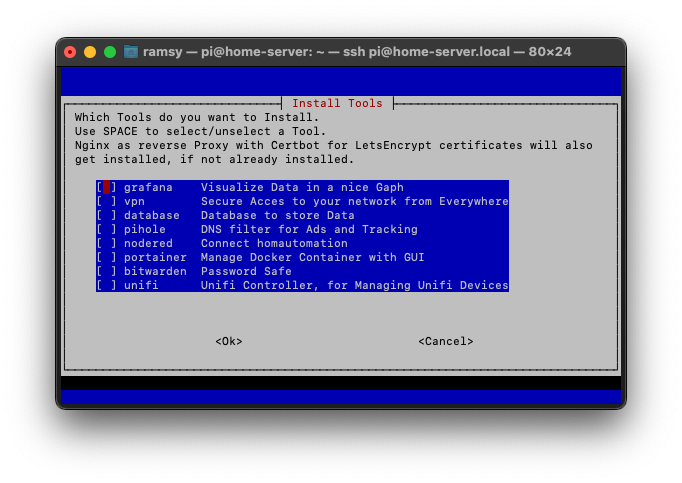

13. If you choose either Portainer, Grafana, Database, VPN or PiHole you will get prompted to type in a default Password. It will be the same for all applications, and you can change it on the webinterface after installation.

14. If you complete this task successfully, the installation begins. Please be patient, this could take a while. As soon as the installation is completed, you will get notified.

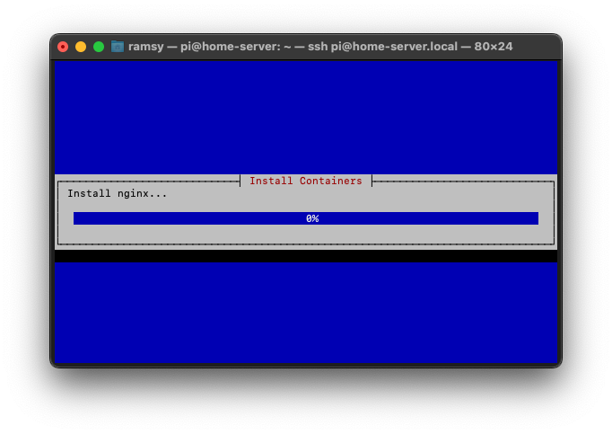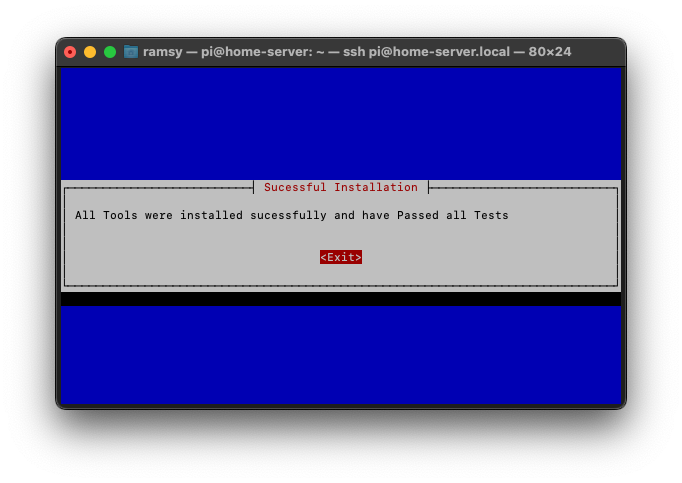

15. You can now close the Terminal or PowerShell. The installation is now finished.

<b>All Products are now available as described in the [README](../README.md)</b>