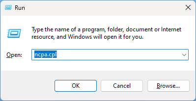
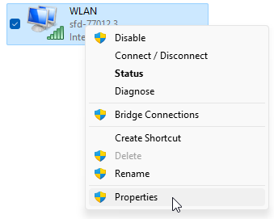
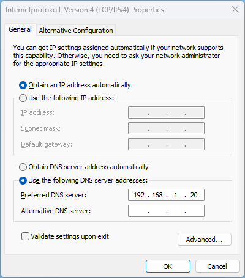

# How to install the Containers

- [How to install the Containers](#how-to-install-the-containers)
  - [Check prerequisites](#check-prerequisites)
  - [Connect to Raspberry Pi](#connect-to-raspberry-pi)
  - [Start the Script](#start-the-script)
  - [Ports that need to be forwarded to Raspberry Pi](#ports-that-need-to-be-forwarded-to-raspberry-pi)
  - [Continue with the Script](#continue-with-the-script)
  - [Change DNS Server](#change-dns-server)
    - [Localy](#localy)
    - [Network wide](#network-wide)

## Check prerequisites

Please check all prerequisites from [Readme.md](../README.md)

## Connect to Raspberry Pi

1. To begin, Log-in to your Raspberry Pi via ssh. 
      - If you use Windows, open PowerShell
      - If you use Linux or macOS open Terminal
2. Enter the following command:
   - change the "pi" to your Username, if you changed it during installation
   - replace "home-server" with the hostname you set during installation
  
```
ssh pi@home-server.local
```

3. On the first connection, you will get a warning, that you're connecting to an unknown Device. To confirm that, enter "yes" and confirm by pressing Enter
4. Enter your Password and confirm by pressing Enter. **Note: you will not see any input, when you enter your Password**
5. If the Connection was successfully, you should see the following line in your command prompt:

```
pi@home-server:~ $
```

6. If you connected Successfully to the Raspberry Pi, elevate yourself to superuser using the following command:
```
sudo su
```

## Start the Script

1. Copy the following Code into your Bash Command Line
```
cd /tmp; rm install.sh &> /dev/null; wget https://raw.githubusercontent.com/b-tomasz/Simplify-Home-Automation/main/install.sh &> /dev/null; bash install.sh
```

2. After the script started, select Install and press Enter


  
3. The System will now check a few parameters. Like the following:
    - your systems architecture
    - if your System is up-to-date
  
<br>

4. If one or multiple fail, you will get notified like this:


5. In the next prompt, you will be asked to update the System.
Select "Update" to start the process


6. As soon the update is finished, the script continues with some essential prompts.

    - Please enter Fixed IP and IP of your Router.


7. The next prompt is about the External Domain, this will be used to connect to your system via this domain. If you select Yes, your port forwarding must be active to the Raspberry Pi as described in the script. Your External Domain must resolve to your Public IP. For example, you can use Bitwarden from everywhere. If you select no, Bitwarden, VPN and SSL can't be installed.


8. If you choose yes, you will get asked to type in your External Domain and your E-Mail address. Otherwise, this part will get skipped.


9. Now the Raspberry Pi needs to reboot, to apply the configured Settings. Reconnect to the Pi as described earlier.

## Ports that need to be forwarded to Raspberry Pi

If you use an external Domain to use SSL Certificates (what we strongly reccomend) then it is necessary that you forward the follwing Ports to Your Raspberry Pi 

- HTTP: 80 (tcp)
  - Used to generate SSL certificates and redirert http to https
- HTTPS: 443 (tcp)
  - Used to Access Bitwarden from Outside your Network
- VPN: 10000 (udp)
  - Used to connect to your Homenetwork via a VPN

How you have to enable the Portforwording strongly depends on your Router. If you couln't find it, then search on Google, how you can add a Portforwarding on your Router Modell.
Here we show, how it is done with the Internet-Box Routers of the Provider Swisscom. On most routers it will work in a simmilar way.

>We reccomend that you do these Steps after you set the Fixed Ip of your Raspberry Pi.

1. Open the Webinterface of your Router by entering the IP Address of your Router in the Webbrowser. If you didn't changed the IP it will be 192.168.1.1
2. Enable the Expert mode on the left side and then navigate to **Network -> Settings -> Port forwarding**
3. Click on **Add new rule**

   

4. Enter **HTTP** as Name and **80** as the Entry Port

   

5. Select the Protocol, Under Device select your Raspberry Pi. Make sure, that you select the Fixed IP you set during installation, otherwise it may not work correctly
   
   

6. Repeate Step 3 - 5 for the **HTTPS** and **VPN Port**

## Continue with the Script

1.  After you successfully reconnected to the pi, and added the Portforwarding, you need to restart the script using the following command:
```
cd /tmp; rm install.sh &> /dev/null; wget https://raw.githubusercontent.com/b-tomasz/Simplify-Home-Automation/main/install.sh &> /dev/null; bash install.sh
```

2. Choose install. Now the Docker installation begins. This is the prerequisite for all the following steps.


3.   As soon as Docker is installed, the next prompt will ask what Applications to install. You can navigate with the arrows and select with the space bar on the keyboard. Confirm your selection with Enter.


4. If you choose either Portainer, Grafana, Database, VPN or PiHole you will get prompted to type in a default Password. It will be the same for all applications, and you can change it on the webinterface after installation.

5. If you complete this task successfully, the installation begins. Please be patient, this could take a while. As soon as the installation is completed, you will get notified.


6. You can now close the Terminal or PowerShell. The installation is now finished.

## Change DNS Server

That you can Access all Tools with theire DNS Name, it is Necessary that You change the DNS Server to your Raspberry Pi. There are two Options how you could do this. You can either change the DNS Setting Localy on your Computer or you change the DNS on your Router. If you change this Localy, it applies only for your Computer, or you have to change this on every Device.

### Localy

>This Method applies only for that device you change it. It is fine for Testing purposes. For a final Installation we reccomend using the [Network wide](#network-wide) setting.

1. Press the **Windows Key + R**
2. Enter **ncpa.cpl** an presse Enter
   
   

3. Right Click on your Used Network connection and select **Preferences** 
   
   
   
4. Double Click on **Internet Protokoll Version 4** to open your IP settings
   
   
   
5. Cahnge to **Folgende DNS-Serveradressen verwenden** and enter the IP of your Raspberry Pi
   
   

6. Click on **OK** to close the dialog boxes.

### Network wide

>This Mathod applies for all Devices connected to your Networ and is the best option for a final installation.

1. Open the Webinterface of your Router by entering the IP Address of your Router in the Webbrowser. If you didn't changed the IP it will be 192.168.1.1
2. Enable the Expert mode on the left side and then navigate to **Network -> Settings -> IP setting**
3. Scroll down to **IP address distribution (DHCP)**
4. Enable the Checkbox **DNS servers advertised via DHCP options 6** and enter the IP Address of your Raspberry Py

    

5. You have to reconnect your Device that this Change applies to your Device 

<b>All Products are now available as described in the [README](../README.md)</b>