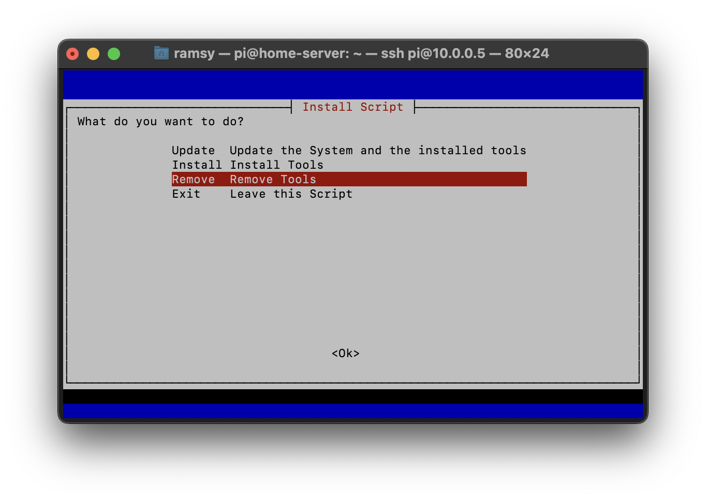
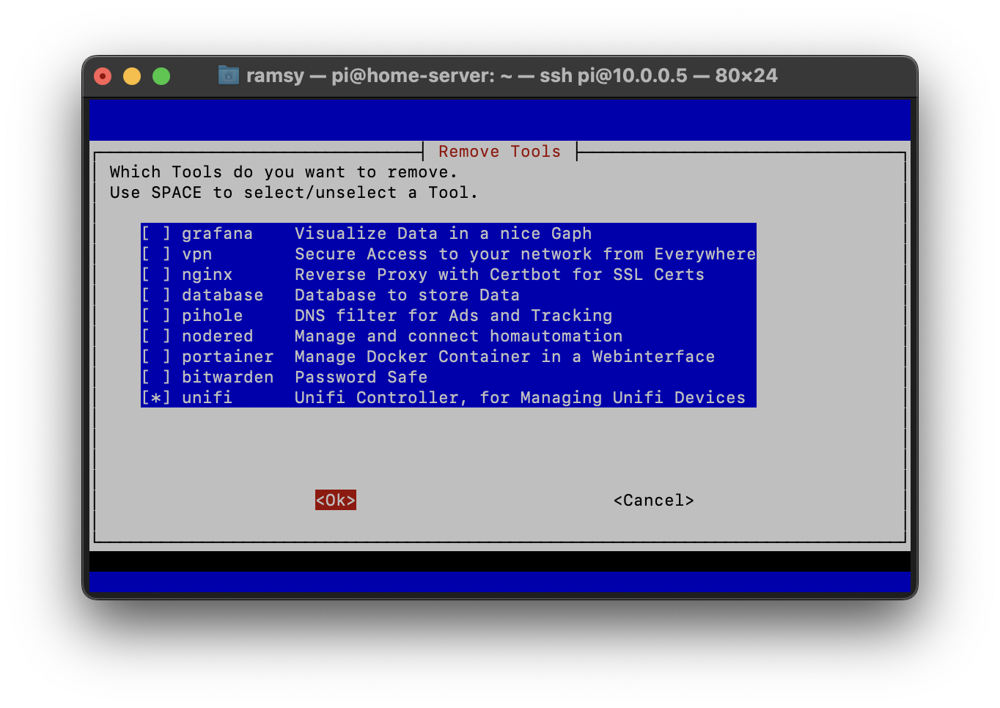
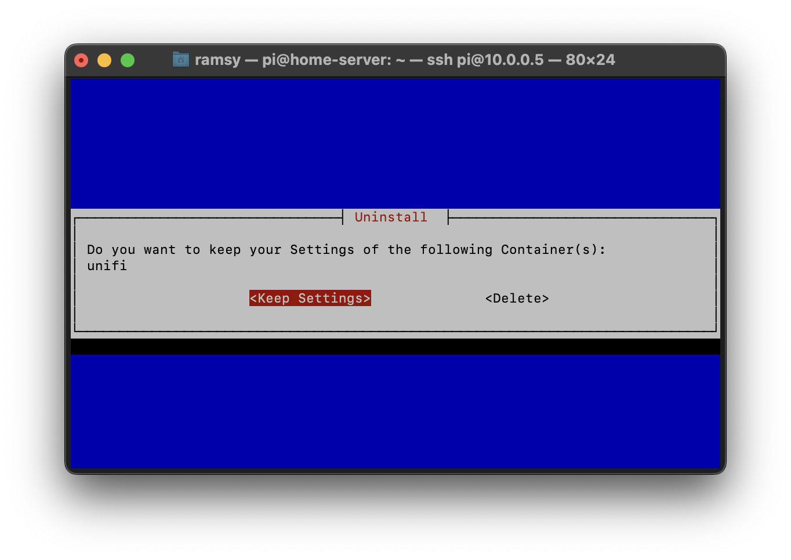
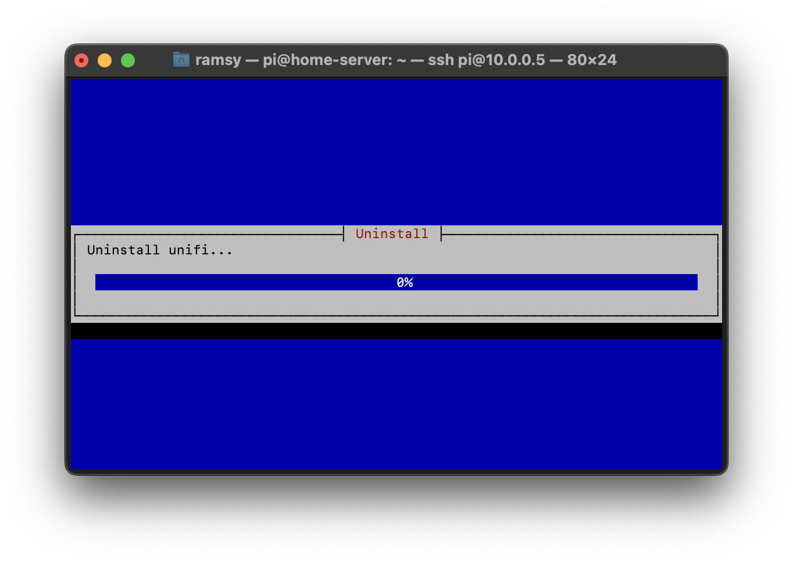

# How to uninstall a container from the system

- [How to uninstall a container from the system](#how-to-uninstall-a-container-from-the-system)
  - [Connect to Raspberry Pi](#connect-to-raspberry-pi)
  - [Start the script](#start-the-script)

## Connect to Raspberry Pi
1. To begin, log-in to your Raspberry Pi via ssh. 
      - If you use Windows, open PowerShell
      - If you use Linux or macOS open Terminal
2. Enter the following command:
   - change the "pi" to your Username, if you changed it during installation
   - replace "home-server" with the hostname you set during installation
  
```
ssh pi@home-server.local
```

3. On the first connection, you will get a warning, that you're connecting to an unknown device. To confirm that, enter "yes" and confirm by pressing Enter
4. Type in your password and confirm by pressing Enter. **Note: you will not see any input, when you enter your password**
5. If the connection was successfully, you should see the following line in your command prompt:

```
pi@home-server:~ $
```

6. If you connected successfully to the Raspberry Pi, elevate yourself to superuser using the following command:
```
sudo su
```

## Start the script
1. Copy the following code into your Bash command line
```
cd /tmp; rm install.sh &> /dev/null; wget https://raw.githubusercontent.com/b-tomasz/Simplify-Home-Automation/main/install.sh &> /dev/null; bash install.sh
```

2. After the script started, select "Remove" and press Enter


  
3. You will be asked which of the installed tools you want to remove. Choose the tools with your space bar and arrows on the keyboard.



4. If you hit Enter, you will get asked if you want to delete the persistent data. If you need the data or plan to reinstall the tool, you can select keep settings. Otherwise, we recommend deleting them.



5. Now the removal begins.



After a successful removal, you are finished and can close the command line.
