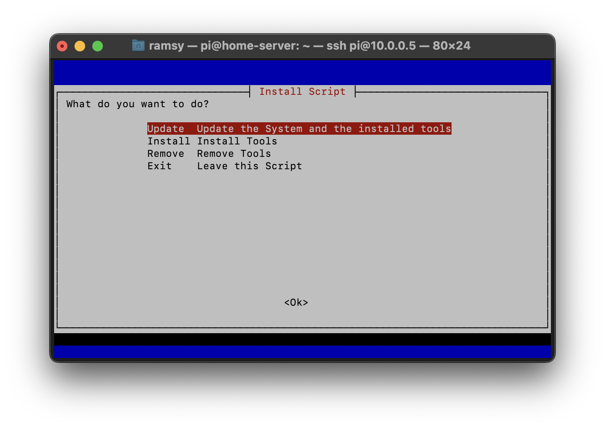
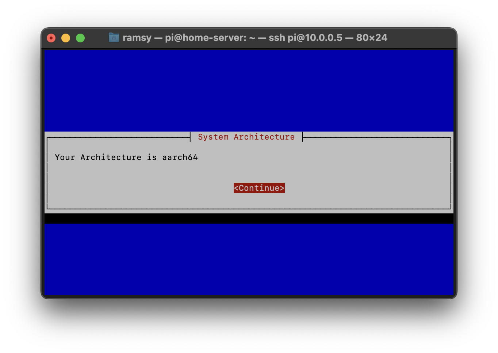
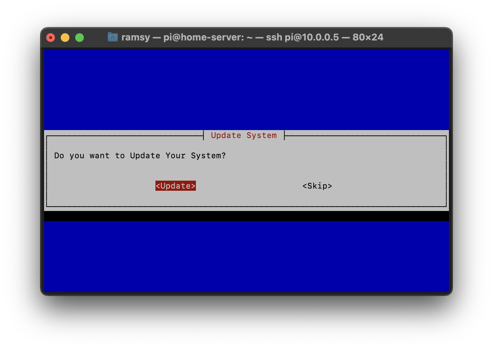
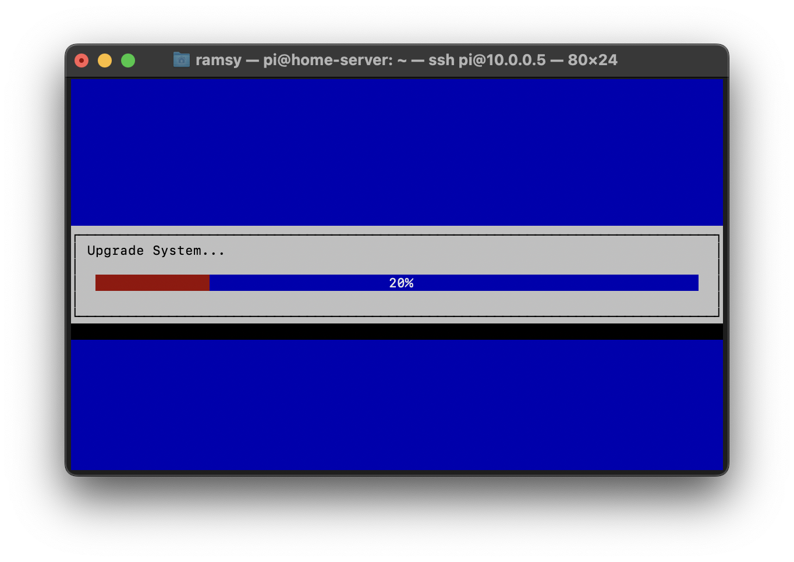

# How to update the System and all Containers

- [How to update the System and all Containers](#how-to-update-the-system-and-all-containers)
  - [Connect to Raspberry Pi](#connect-to-raspberry-pi)
  - [Start the Script](#start-the-script)

## Connect to Raspberry Pi
1. To begin, Log-in to your Raspberry Pi via ssh. 
      - If you use Windows, open PowerShell
      - If you use Linux or macOS open Terminal
2. Enter the following command:
   - change the "pi" to your Username, if you changed it during installation
   - replace "home-server" with the hostname you set during installation
  
```
ssh pi@home-server.local
```

3. On the first connection, you will get a warning, that you're connecting to an unknown Device. To confirm that, enter "yes" and confirm by pressing Enter
4. Enter your Password and confirm by pressing Enter. **Note: you will not see any input, when you enter your Password**
5. If the Connection was successfully, you should see the following line in your command prompt:

```
pi@home-server:~ $
```

6. If you connected Successfully to the Raspberry Pi, elevate yourself to superuser using the following command:
```
sudo su
```

## Start the Script
1. Copy the following Code into your Bash Command Line
```
cd /tmp; rm install.sh &> /dev/null; wget https://raw.githubusercontent.com/b-tomasz/Simplify-Home-Automation/main/install.sh &> /dev/null; bash install.sh
```

2. After the script started, select Update and press Enter


  
3. The System will now check your architecture.



4. The script asks you no if you want to install updates or exit. Choose update.



5. The system and all containers will be updated. 



After successful update, you are done and can close the command line.

