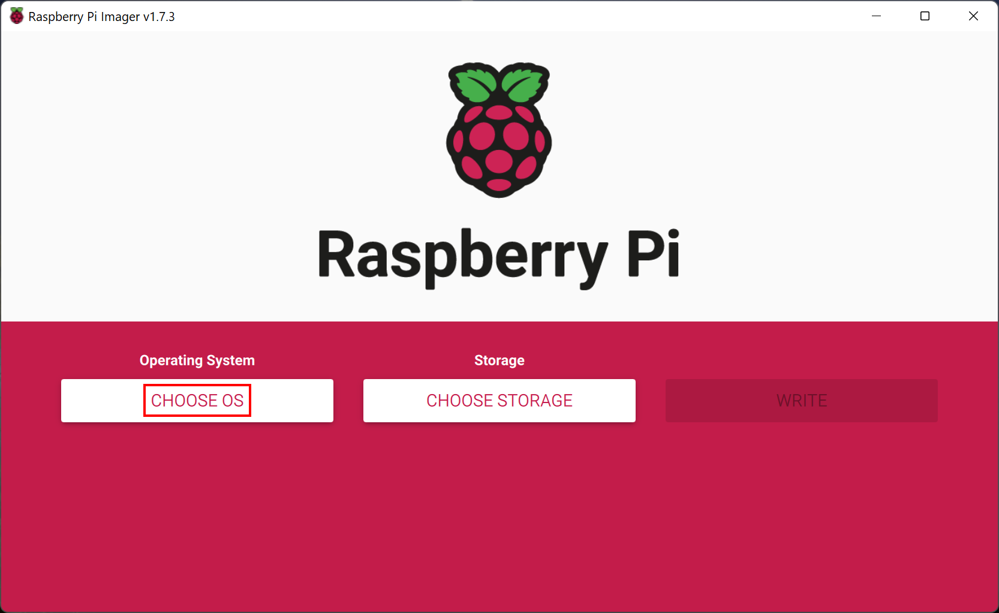
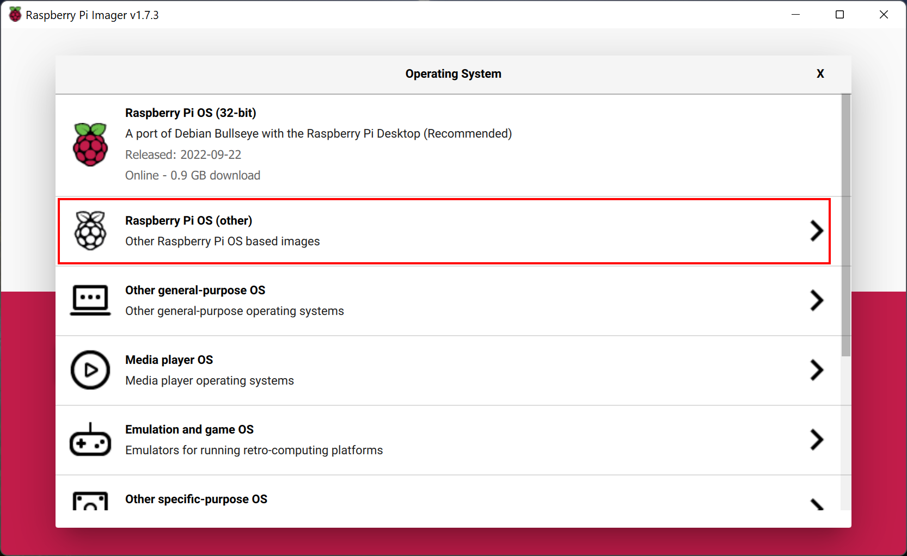
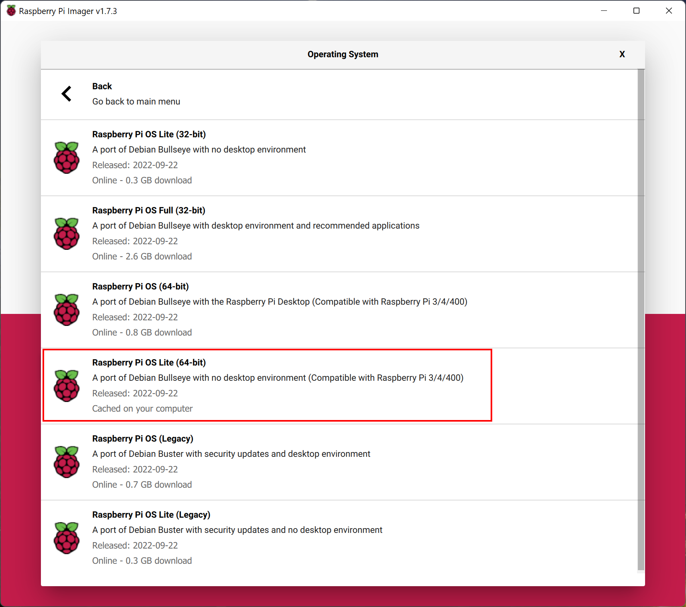
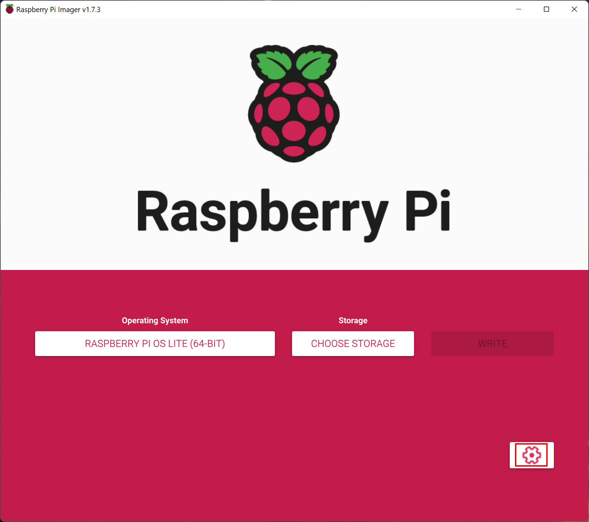
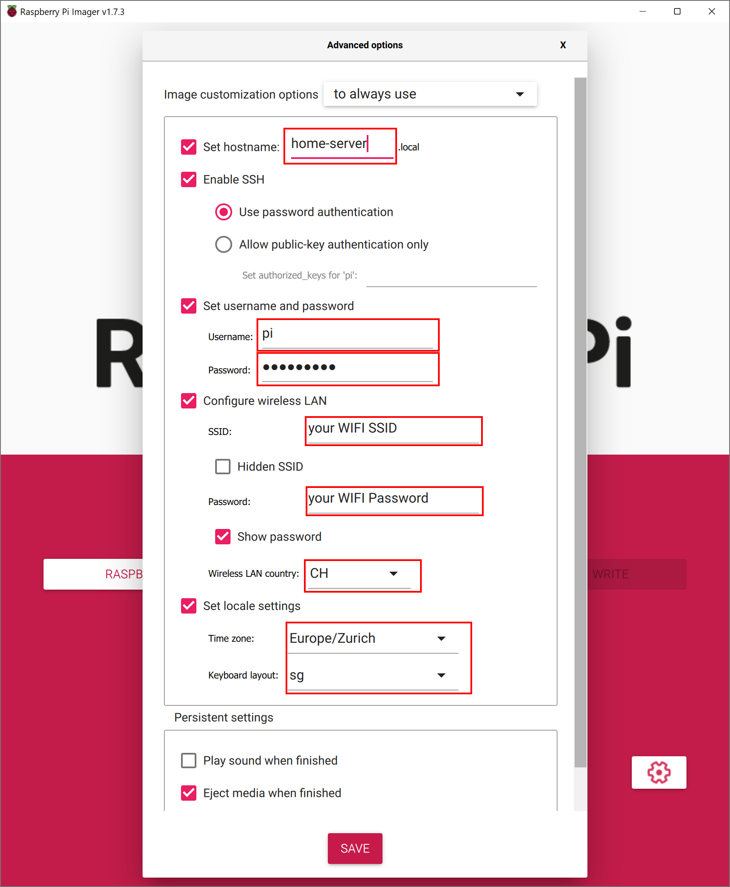
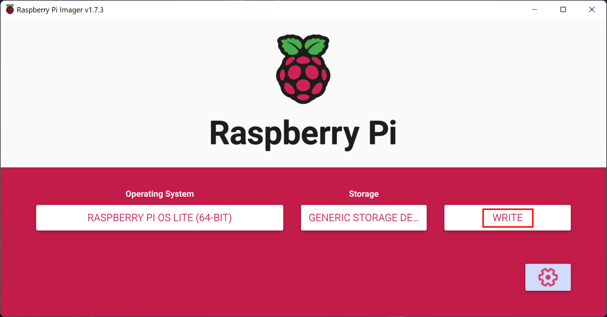
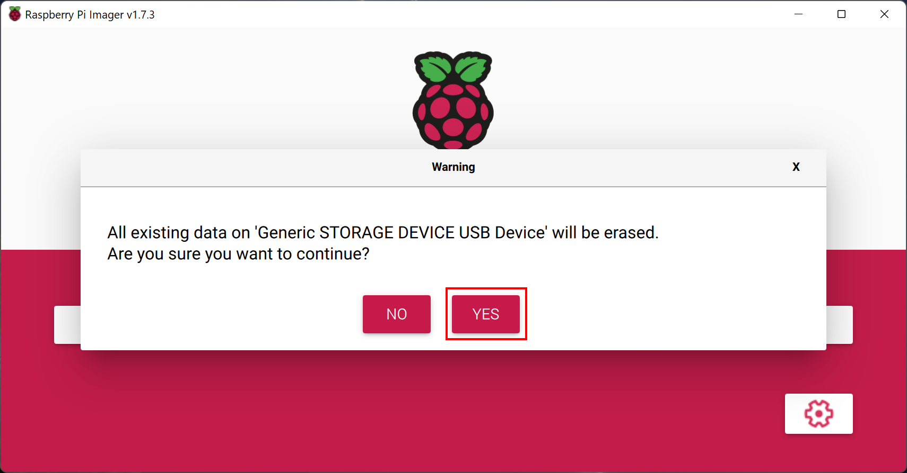

# How to setup your Raspberry Pi

- [How to setup your Raspberry Pi](#how-to-setup-your-raspberry-pi)
  - [What you need to Start](#what-you-need-to-start)
  - [Installation of the Operating System](#installation-of-the-operating-system)

## What you need to Start

You should prepare the follwoing items, before you continue:
> - Raspberry Pi 4B (at least 4 GB of RAM are recommended)
>   - Power Supply
>   - Micro SD Card
> - Computer with SD card reader
> - Ethernet Cable

## Installation of the Operating System

To flash the Operating System to the SD Card we are using the [Raspberry Pi Imager](https://www.raspberrypi.com/software/).

1) Download and install the Rapberry Pi Imager on your Computer
2) Start the Imager
3) Click on "Chose OS"

4) Select "Raspberry Pi (Other)"

5) Select "Raspberry Pi OS Lite (64-bit)" **Be sure, that you chose the 64-bit Version** 

6) Test

7) Test

8) Test

9) Test
