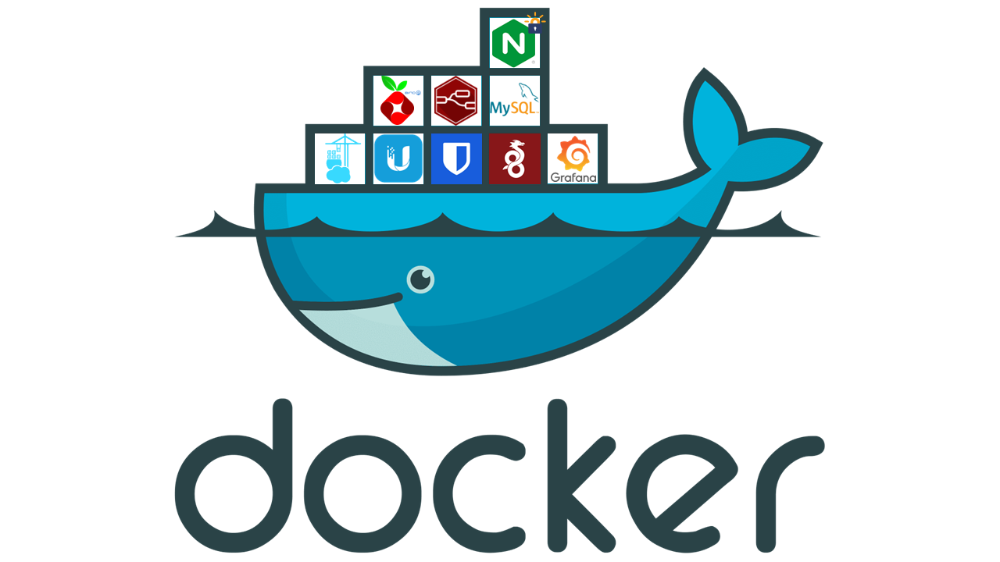
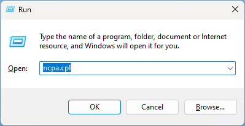
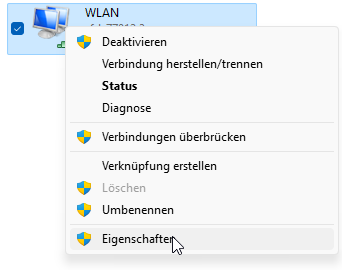
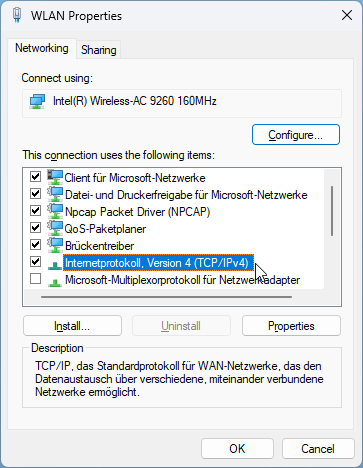
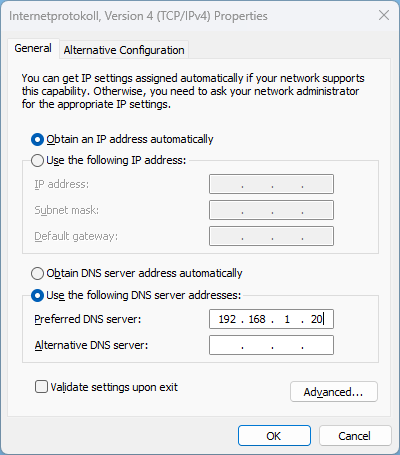
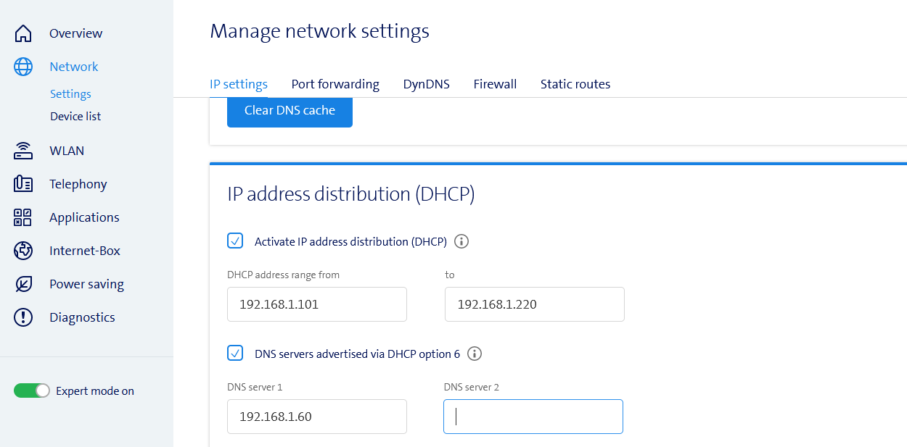

# Simplify-Home-Automation



- [Simplify-Home-Automation](#simplify-home-automation)
  - [Overview](#overview)
  - [Prerequisites:](#prerequisites)
  - [Application List with IP-addresses](#application-list-with-ip-addresses)
  - [Networks](#networks)
  - [Ports that need to be forwarded to Raspberry Pi](#ports-that-need-to-be-forwarded-to-raspberry-pi)
    - [Network wide](#network-wide)
  - [Application default Username's](#application-default-usernames)
  - [Start the Installation script](#start-the-installation-script)

## Overview

This Repository is designed get easy access to Home automation and Home Network management.

[Setup your Raspberry Pi](Documentation/01-setup.md)

## Prerequisites:

> - Raspberry Pi 4 (RaspbianOS 64-Bit)
>    - Power Supply
>    - SD Card / SD Card Reader
>    - Ethernet Cable
> - (DynDNS)

[Start installation with your Raspberry Pi](Documentation/01-setup.md)

## Application List with IP-addresses

| Container | IP address | Ports                                             | Web address                              |
| --------- | ---------- | ------------------------------------------------- | ---------------------------------------- |
| Nginx     | 10.10.10.1 | 80:80, 443:443                                    | -                                        |
| - Certbot | 10.10.10.2 | -                                                 | -                                        |
| Portainer | 10.10.20.1 | (9000:9443)                                       | portainer.home / portainer.[your Domain] |
| Pihole    | 10.10.30.1 | 53:53, (8000:80)                                  | pihole.home / pihole.[your Domain]       |
| - DNS     | 10.10.30.2 | -                                                 | -                                        |
| VPN       | 10.10.40.1 | 10000:51820                                       | vpn.[your Domain]                        |
| Bitwarden | 10.10.50.1 | (8001:80, 9001:443)                               | bitwarden.home / bitwarden.[your Domain] |
| Nodered   | 10.10.60.1 | (8002:1880)                                       | nodered.home / nodered.[your Domain]     |
| Database  | 10.10.70.1 | (10002:3306)                                      | -                                        |
| - Adminer | 10.10.70.2 | (8003:8080)                                       | database.home / database.[your Domain]   |
| Grafana   | 10.10.80.1 | (8004:3000)                                       | grafana.home / grafana.[your Domain]     |
| Unifi     | 10.10.90.1 | 8443:8443, 3478:3478,<br />8080:8080, 10001:10001 | unifi.home / unifi.[your Domain]         |

All Ports marked with brackets () are not active, but can be activated in the docker-compose.yml File of each container. These are only required if you want to access the Container directly.

## Networks

- Default homeautomation
- Network is defined in Nginx Container

## Ports that need to be forwarded to Raspberry Pi

If you use an external Domain to use SSL Certificates (what we strongly reccomend) then it is necessary that you forward the follwing Ports to Your Raspberry Pi 

1. Press the **Windows Key + R**
2. Enter **ncpa.cpl** an presse Enter
   
   

3. Right Click on your Used Network connection and select **Properties** 
   
   
   
4. Double Click on **Internetprotokoll Version 4** to open your IP settings
   
   
   
5. Cahnge to **Use the following DNS server addresses** and enter the IP of your Raspberry Pi
   
   

6. Click on **OK** to close the dialog boxes.

### Network wide

>This Mathod applies for all Devices connected to your Networ and is the best option for a final installation.

1. Open the Webinterface of your Router by entering the IP Address of your Router in the Webbrowser. If you didn't changed the IP it will be 192.168.1.1
2. Enable the Expert mode on the left side and then navigate to **Network -> Settings -> IP setting**
3. Scroll down to **IP address distribution (DHCP)**
4. Enable the Checkbox **DNS servers advertised via DHCP options 6** and enter the IP Address of your Raspberry Py

    

5. You have to reconnect your Device that this Change applies to your Device 


All folders get created in  /var/homeautomation \
Script folder               /var/homeautomation/script \
Apllicationfolder           /var/homeautomation/$Applicationname

## Application default Username's

During installation you enter an Password. That Password will be set for all containers as default Password. You can change the Passwords after installation in the Webinterface of each Container.

| Container | Username |
| --------- | -------- |
| Portainer | admin    |
| Pihole    | admin    |
| VPN       | admin    |
| Database  | root     |
| Grafana   | admin    |

## Start the Installation script
```
cd /tmp; rm install.sh &> /dev/null; wget https://raw.githubusercontent.com/b-tomasz/Simplify-Home-Automation/main/install.sh &> /dev/null; bash install.sh
```