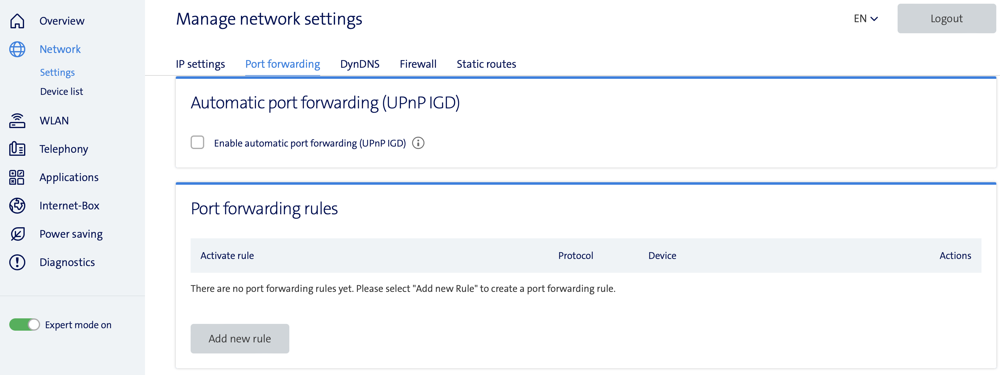
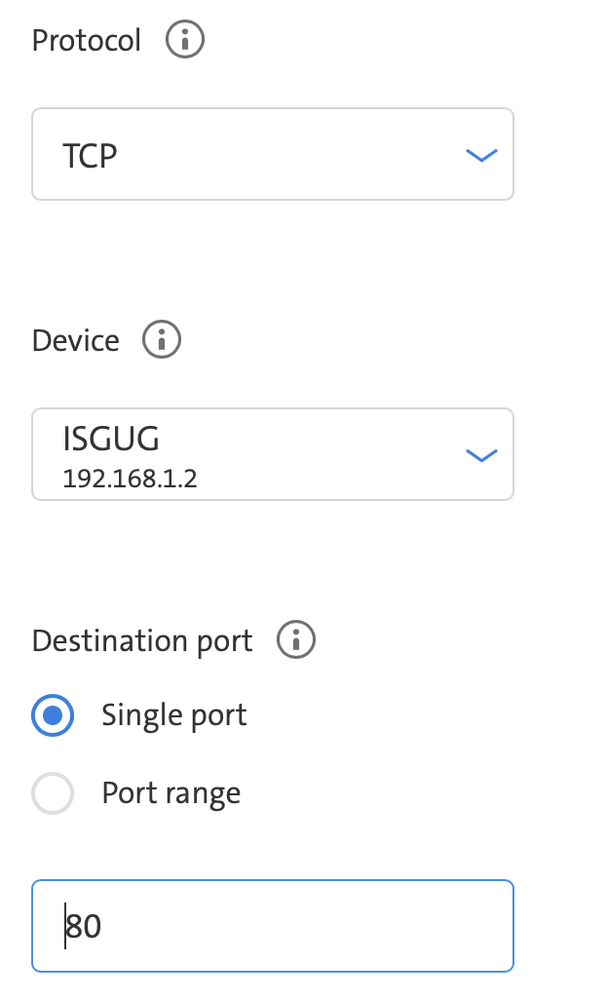

# Simplify-Home-Automation

- [Simplify-Home-Automation](#simplify-home-automation)
  - [Prerequisites:](#prerequisites)
  - [Ports that need to be forwarded to Raspberry Pi](#ports-that-need-to-be-forwarded-to-raspberry-pi)
  - [Folder Configuration](#folder-configuration)
  - [Networks](#networks)
  - [Application List with IP-address](#application-list-with-ip-address)
  - [Change DNS Server](#change-dns-server)
    - [Localy](#localy)
    - [Network wide](#network-wide)
  - [Application default Username's](#application-default-usernames)
  - [Setup your Raspberry Pi](#setup-your-raspberry-pi)
  - [Install Documentation](#install-documentation)
  - [Start the Installation script](#start-the-installation-script)

## Prerequisites:
> - Raspberry Pi
>    - Power Supply
>    - SD Card
>    - Ethernet Cable   
> - Home Network
> - DynDNS

## Ports that need to be forwarded to Raspberry Pi

If you use an external Domain to use SSL Certificates (what we strongly reccomend) then it is necessary that you forward the follwing Ports to Your Raspberry Pi 

- HTTP: 80 (tcp)
  - Used to generate SSL certificates and redirert http to https
- HTTPS: 443 (tcp)
  - Used to Access Bitwarden from Outside your Network
- VPN: 10000 (udp)
  - Used to connect to your Homenetwork via a VPN

How you have to enable the Portforwording strongly depends on your Router. If you couln't find it, then search on Google, how you can add a Portforwarding on your Router Modell.
Here we show, how it is done with the Internet-Box Routers of the Provider Swisscom. On most routers it will work in a simmilar way.

>We reccomend that you do these Steps after you set the Fixed Ip of your Raspberry Pi.

1. Open the Webinterface of your Router by entering the IP Address of your Router in the Webbrowser. If you didn't changed the IP it will be 192.168.1.1
2. Enable the Expert mode on the left side and then navigate to **Network -> Settings -> Port forwarding**
3. Click on **Add new rule**

   

4. Enter **HTTP** as Name and **80** as the Entry Port

   

5. Select the Protocol, Under Device select your Raspberry Pi. Make sure, that you select the Fixed IP you set during installation, otherwise it may not work correctly
   
   

6. Repeate Step 3 - 5 for the **HTTPS** and **VPN Port**

## Folder Configuration

All folders get created in  /var/homeautomation \
Script folder               /var/homeautomation/script \
Apllicationfolder           /var/homeautomation/$Applicationname

## Networks
- Default homeautomation
- Network is defined in Nginx Container

## Application List with IP-address
| Container | IP address | Ports                                             | Web address                              |
| --------- | ---------- | ------------------------------------------------- | ---------------------------------------- |
| Nginx     | 10.10.10.1 | 80:80, 443:443                                    | -                                        |
| - Certbot | 10.10.10.2 | -                                                 | -                                        |
| Portainer | 10.10.20.1 | (9000:9443)                                       | portainer.home / portainer.[your Domain] |
| Pihole    | 10.10.30.1 | 53:53, (8000:80)                                  | pihole.home / pihole.[your Domain]       |
| - DNS     | 10.10.30.2 | -                                                 | -                                        |
| VPN       | 10.10.40.1 | 10000:51820                                       | vpn.[your Domain]                        |
| Bitwarden | 10.10.50.1 | (8001:80, 9001:443)                               | bitwarden.home / bitwarden.[your Domain] |
| Nodered   | 10.10.60.1 | (8002:1880)                                       | nodered.home / nodered.[your Domain]     |
| Database  | 10.10.70.1 | (10002:3306)                                      | -                                        |
| - Adminer | 10.10.70.2 | (8003:8080)                                       | database.home / database.[your Domain]   |
| Grafana   | 10.10.80.1 | (8004:3000)                                       | grafana.home / grafana.[your Domain]     |
| Unifi     | 10.10.90.1 | 8443:8443, 3478:3478,<br />8080:8080, 10001:10001 | unifi.home / unifi.[your Domain]         |

All Ports marked with brackets () are not active, but can be activated in the docker-compose.yml File of each container. These are only required if you want to access the Container directly.

## Change DNS Server

That you can Access all Tools with theire DNS Name, it is Necessary that You change the DNS Server to your Raspberry Pi. There are two Options how you could do this. You can either change the DNS Setting Localy on your Computer or you change the DNS on your Router. If you change this Localy, it applies only for your Computer, or you have to change this on every Device.

### Localy

>This Method applies only for that device you change it. It is fine for Testing purposes. For a final Installation we reccomend using the [Network wide](#network-wide) setting.

1. Press the **Windows Key + R**
2. Enter **ncpa.cpl** an presse Enter
   
   

3. Right Click on your Used Network connection and select **Preferences** 
   
   
   
4. Double Click on **Internet Protokoll Version 4** to open your IP settings
   
   
   
5. Cahnge to **Folgende DNS-Serveradressen verwenden** and enter the IP of your Raspberry Pi
   
   

6. Click on **OK** to close the dialog boxes.

### Network wide

>This Mathod applies for all Devices connected to your Networ and is the best option for a final installation.

1. Open the Webinterface of your Router by entering the IP Address of your Router in the Webbrowser. If you didn't changed the IP it will be 192.168.1.1
2. Enable the Expert mode on the left side and then navigate to **Network -> Settings -> IP setting**
3. Scroll down to **IP address distribution (DHCP)**
4. Enable the Checkbox **DNS servers advertised via DHCP options 6** and enter the IP Address of your Raspberry Py

    

5. You have to reconnect your Device that this Change applies to your Device 


## Application default Username's

During installation you enter an Password. That Password will be set for all containers as default Password. You can change the Passwords after installation in the Webinterface of each Container.

| Container | Username |
| --------- | -------- |
| Portainer | admin    |
| Pihole    | admin    |
| VPN       | admin    |
| Database  | root     |
| Grafana   | admin    |

## [Setup your Raspberry Pi](Documentation/01-setup.md)

## [Install Documentation](Documentation/02-install.md)

## Start the Installation script
```
cd /tmp; rm install.sh &> /dev/null; wget https://raw.githubusercontent.com/b-tomasz/Simplify-Home-Automation/main/install.sh &> /dev/null; bash install.sh
```